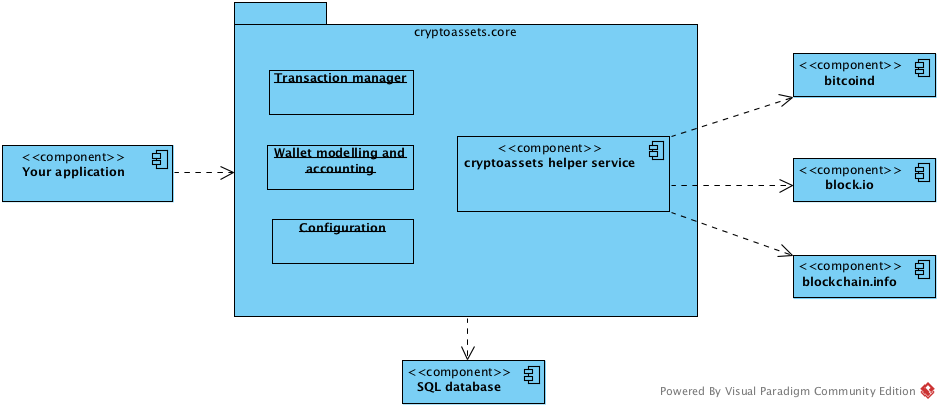

================================
Getting started
================================

.. contents:: :local:

Introduction
==============

This tutorial introduces *cryptoassets.core*: what it does for you and how to set up a trivial Bitcoin wallet command line application on the top of it.

`cryptoassets.core <https://bitbucket.org/miohtama/cryptoassets>`_ is a Python framework providing safe, scalable and future-proof cryptocurrency and cryptoassets accounting for your Python application. You can use it to accept cryptocurrency payments, build cryptoasset services and exchanges.

* `See PyPi download page <https://pypi.python.org/pypi/cryptoassets.core>`_

* `See project homepage <https://bitbucket.org/miohtama/cryptoassets>`_

Benefits
==============

*cryptoassets.core* is built on the top of `Python programming language <http://python.org>`_, community ecosystem and best practices. Python is proven tool for building financial applications and is widely used to develop cryptoassets software and Bitcoin exchanges. *cryptoassets.core* is

* `Easy <http://cryptoassetscore.readthedocs.org/en/latest/gettingstarted.html>`_: Documented user-friendly APIs.

* `Extensible <http://cryptoassetscore.readthedocs.org/en/latest/extend.html>`_: Any cryptocurrency and cryptoassets support.

* `Safe <http://cryptoassetscore.readthedocs.org/en/latest/integrity.html>`_: Secure and high data integrity.

* `Lock-in free <http://cryptoassetscore.readthedocs.org/en/latest/backends.html>`_: Vendor independent and platform agnostics.

* `Customizable <http://cryptoassetscore.readthedocs.org/en/latest/extend.html#overriding-parts-of-the-framework>`_: Override and tailor any part of the framework for your specific needs.

Basics
======

* You can use *cryptoassets.core* framework in any Python application, including Django applications. Python 3 is required.

* *cryptoassets.core* is designed to be extendable to support `altcoins and different cryptoassets <http://coinmarketcap.com/>`_.

* *cryptoassets.core* works with API services (block.io, blockchain.info) and daemons (*bitcoind*, *dogecoind*). The framework uses term *backend* to refer these. You either sign up for an account on the API service or run the daemon on your own server (*)

* Basic `SQLAlchemy <http://www.sqlalchemy.org/>`_ knowledge is required for using the models API.

* A separate a :doc:`cryptoassets helper service <./service>` process is responsible for communicating between your application and cryptoasset networks. This process runs on background on your server.

* *cryptoassets.core* framework is initialized from a :doc:`configuration <./config>`, which can be passed in as a Python dictionary or a YAML configuration file.

* :doc:`For data integrity reasons <./integrity>`, *cryptoassets.core* database connection usually differs from the default application database connection.

* At the moment *cryptoassets.core* is in initial version 0.1 release. Expect the scope of the project to expand to support other cryptoassets (`Counterparty <http://counterparty.io/>`_, `Ethereum <http://ethereum.org/>`_, `BitShares-X <http://wiki.bitshares.org/index.php/Bitshares_X>`_) out of the box.

.. note ::

    Please note that running *bitcoind* on a server requires at least 2 GB of RAM and 25 GB of disk space, so low end box hosting plans are not up for the task.

Interacting with cryptoassets.core
-----------------------------------

The basic programming flow with *cryptoassets.core* is

* You set up :py:class:`cryptoassets.core.app.CryptoAssetsApp` instance and configure it inside your Python code.

* You set up a channel how :doc:`cryptoassets helper service <./service>` process calls backs your application. Usually this happens over :doc:`HTTP web hooks <./config>`.

* You put your cryptoassets database accessing code to a separate function and decorate it with :py:class:`cryptoassets.core.app.CryptoAssetsApp.conflict_resolver` to obtain transaction conflict aware SQLAlchemy session.

* In your cryptoasset application logic, you obtain an instance to :py:class:`cryptoassets.core.models.GenericWallet` subclass. Each cryptoasset has its own set of SQLAlchemy model classes. The wallet instance contains the accounting information: which assets and which transactions belong to which users. Simple applications usually require only one default  wallet instance.

* After having set up the wallet, call various wallet model API methods like :py:meth:`cryptoassets.core.models.GenericWallet.send`.

* For receiving the payments you need to create at least one receiving address (see :py:meth:`cryptoassets.core.models.GenericWallet.create_receiving_address`). *Cryptoassets helper service* triggers :doc:`events <api/events>` which your application listens to and then performs application logic when a payment or a deposit is received.

Example command-line application
========================================

Below is a simple Bitcoin wallet terminal application using `block.io <https://block.io>`_ API service as the backend. It is configured to work with Bitcoin `Testnet <https://en.bitcoin.it/wiki/Testnet>`_. Testnet Bitcoins are worthless, free to obtain and thus useful for application development and testing.

The example comes with pre-created account on block.io. It is recommended that you `sign up for your own block.io <https://block.io/users/sign_up>`_ account and API key and use them instead of ones in the example configuration.

Install cryptoassets.core
---------------------------

:doc:`First make sure you have created a virtualenv and installed cryptoassets.core and its dependencies <./install>`.

Application code
-------------------

.. note ::

    The example is tested only for UNIX systems (Linux and OSX). The authors do not have availability of Microsoft development environments to ensure Microsoft Windows compatibility.

Here is an example walkthrough how to set up a command line application.

Save this as ``example.py`` file.

.. literalinclude:: example.py
    :language: python

Example configuration
----------------------

Save this as ``example.config.yaml`` file.

.. literalinclude:: example.config.yaml
    :language: yaml

Creating the database structure
---------------------------------

The example application uses `SQLite <http://www.sqlite.org/>`_ database as a simple self-contained test database.

Run the command to create the database tables::

    cryptoassets-initialize-database example.config.yaml

This should print out::

    [11:49:16] cryptoassets.core version 0.0
    [11:49:16] Creating database tables for sqlite:////tmp/cryptoassets.example.sqlite

Running the example
---------------------

The example application is fully functional and you can start your Bitcoin wallet business right away. Only one more thing to do...

...the communication between cryptoasset networks and your application is handled by the :doc:`cryptoassets helper service <./service>` background process. Thus, nothing comes in or goes out to your application if the helper service process is not running. Start the helper service::

    cryptoassets-helper-service example.config.yaml

You should see something like this::

    ...
    [00:23:09] [cryptoassets.core.service.main splash_version] cryptoassets.core version 0.0

You might get some connection refused errors, because the app is not up yet. Please ignore those now.

Now leave *cryptoassets helper service* running and start the example application **in another terminal**::

    python example.py

You should see something like this::

    Welcome to cryptoassets example app

    Receiving addresses available:
    (Send testnet Bitcoins to them to see what happens)
    - 2MzGzEUyHgqBXzbuGCJDSBPKAyRxhj2q9hj: total received 0.00000000 BTC

    We know about the following transactions:

    Give a command
    1) Create new receiving address
    2) Send Bitcoins to other address
    3) Quit

You will get some *Rescanned transactions* log messages on the start up if you didn't change the default block.io credentials. These are test transactions from other example users.

Now you can send or receive Bitcoins within your application. If you don't start the helper service the application keeps functioning, but all external cryptoasset network traffic is being buffered until the *cryptoassets helper service* is running again.

If you want to reset the application just delete the database file ``/tmp/cryptoassets.test.sqlite``.

Obtaining testnet Bitcoins and sending them
----------------------------------------------

The example runs on testnet Bitcoins which are not real Bitcoins. Get some testnet coins and send them from the faucet to the receiving address provided by the application.

`List of services providing faucets giving out Testnet Bitcoins <http://bitcoin.stackexchange.com/q/17690/5464>`_.

No more than **0.01** Bitcoins are needed for playing around with the example app.

After sending the Bitcoins you should see a notification printed for an incoming transaction in ~30 seconds which is the time it takes for the Bitcoin transaction to propagate through testnet::

    Got transaction notification txid:512a082c2f4908d243cb52576cd5d22481344faba0d7a837098f9af81cfa8ef3 addr:2N7Fi392deSEnQgiYbmpw1NmK6vMVrVzuwc, confirmations:0

After completing the example
===============================

Explore :doc:`model API documentation <api/models>`, :doc:`configuration <config>` and :doc:`what tools there are available <api/functionality>`.

You can also study `Liberty Music Store open source application, built on the top of Django and Bitcoin <http://libertymusicstore.net/>`_.

Django integration
--------------------

If you are using `Django <http://djangoproject.com/>`_ see `cryptoassets.django package <https://bitbucket.org/miohtama/cryptoassets.django>`_.

More about SQLAlchemy
-------------------------

Please see these tutorials

* `Official SQLAlchemy tutorial <http://docs.sqlalchemy.org/en/rel_0_9/orm/tutorial.html>`_

* `SQLAlchemy ORM Examples <http://www.pythoncentral.io/sqlalchemy-orm-examples/>`_ by Xiaonuo Gantan

Questions?
----------

:doc:`See the community resources how to contact the developers <./community>`.